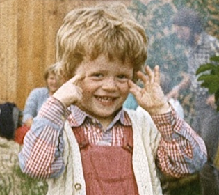

# Czas i Miejsce

Ceremonia planowana jest na 20 sierpnia 2021 roku.
Lokalizacją, którą wybraliśmy jest **Willa Baszta**
znajdująca się przy ulicy *Jodłowej 13a* w krakowskiej dzielnicy Przegrzały ([dojazd](https://goo.gl/maps/DuA8ZpWFDXkmFWKz9)). 

# Plan wieczoru

- Rozpoczęcie planowane jest na godzinę 16.00 ale możemy się spotkać pół godziny wcześniej
- Przysięga małżeńska zostanie złożona przed świadkami oraz przedstawicielem urzędu miasta
- Po złożeniu przysięgi zapraszamy na uroczystą kolację, która również odbędzie się w Baszcie 

# Rezerwacja pokoi hotelowych

- Dostępne są pokoje w sąsiednim *Hotelu Wolskim*
- Rezerwacji można dokonać za pośrednictwem [strony hotelu](https://www.hotelwolski.pl/) lub odezwać się do nas 

# Kontakt

Jesteśmy dostępni pod numerami telefonów:

- Iza: (+48) 111 111 111 111
- Kacper: (+48) 222 222 222 222

# O nas

## Izabela Piotrowska

TODO - króciutko

## Kacper Topolnicki

TODO - króciutko

<!---->

## Nasze plany na przyszłość

